# Patika Tourism Agency System


In this tourism agency system application developed within the scope of the Patika Full Stack Web Development Bootcamp, basic level hotel management, season management, room management, and reservation processes can be performed.
## Technologies
* Java SE 8
* Swing Framework
* PostgreSQL 16
* IntelliJ IDEA Community Edition 2023.3.3 

## Installation

1. Make sure that at least JDK 1.8 is installed on your system.
```bash
java --version
```
2. To clone the project repository, run the following command in the terminal:
```bash
   git clone https://github.com/ikaraozdemir/turizmAgency.git
   ```
3. Follow these steps to import the PostgreSQL backup file located inside the project folder:
   *  Navigate to the project folder in the terminal.
   * Import the PostgreSQL backup file:
   ```bash
   psql -U username -d database_name -f backup_file.sql
   ```
4. Before establishing the database connection, update the username and password in database.properties.

## Secreenshots
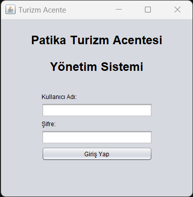 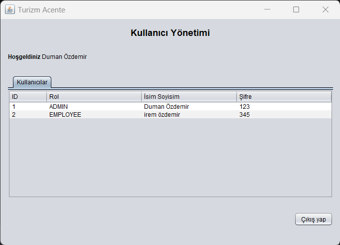
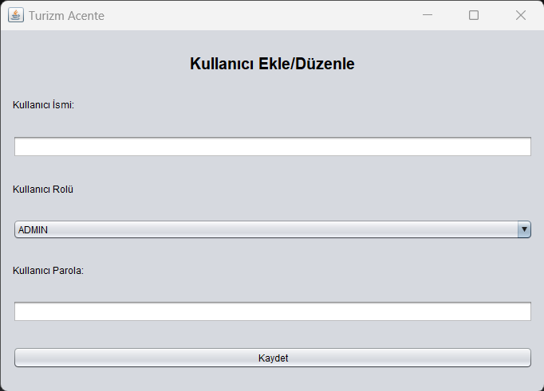 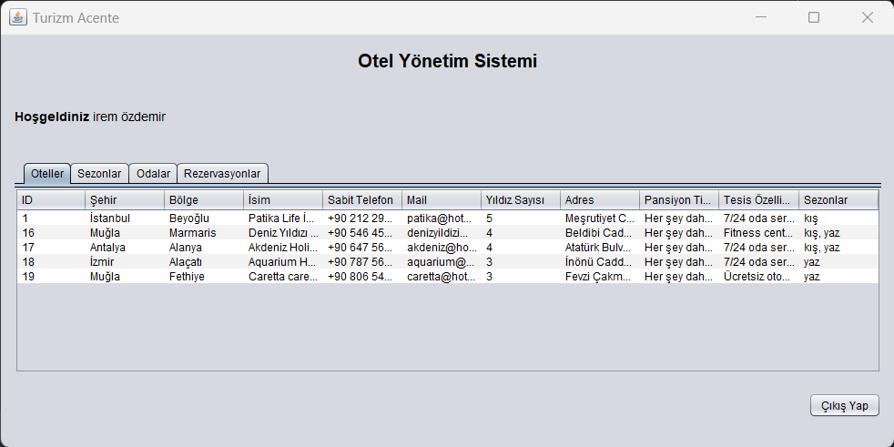
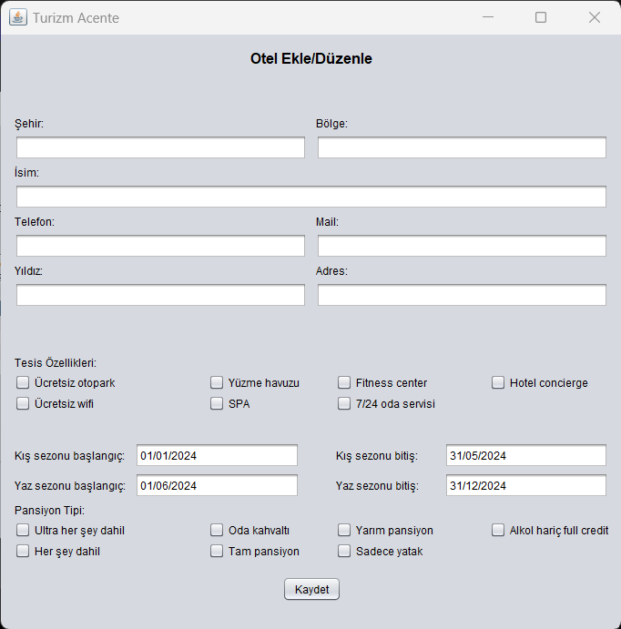 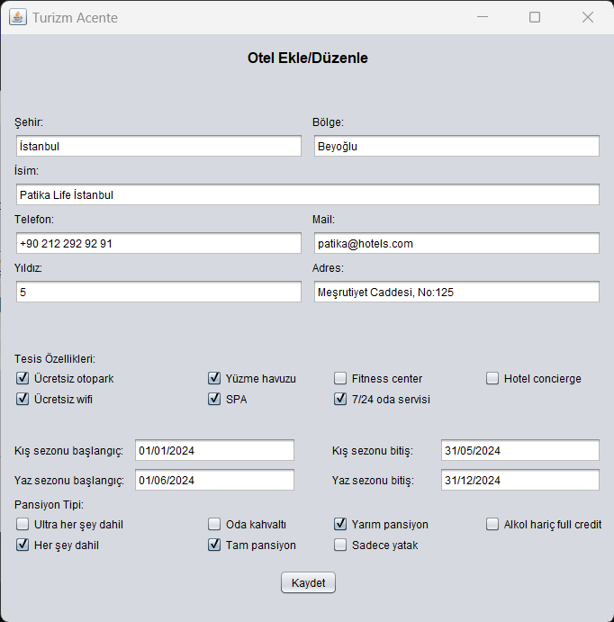
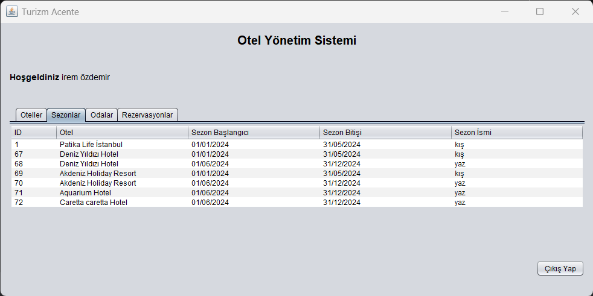 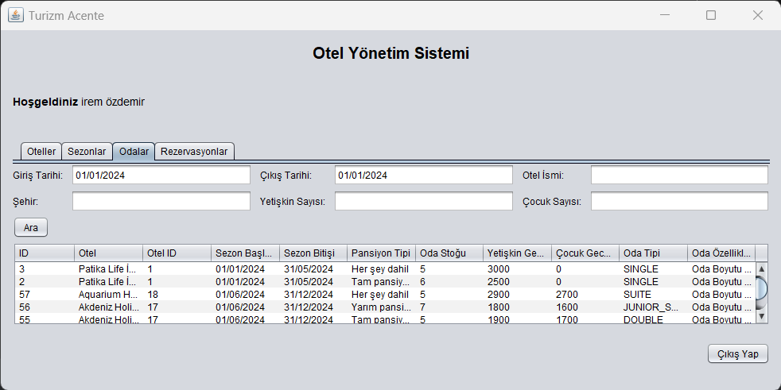 
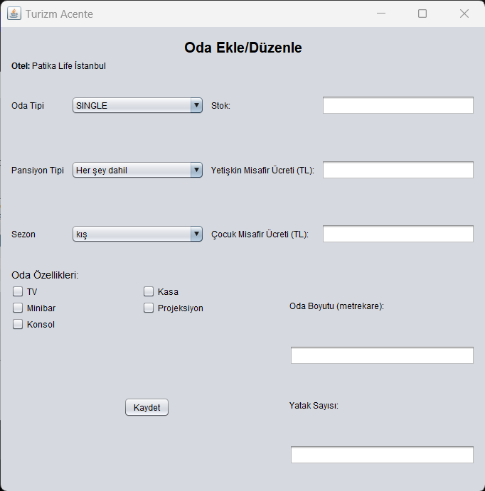 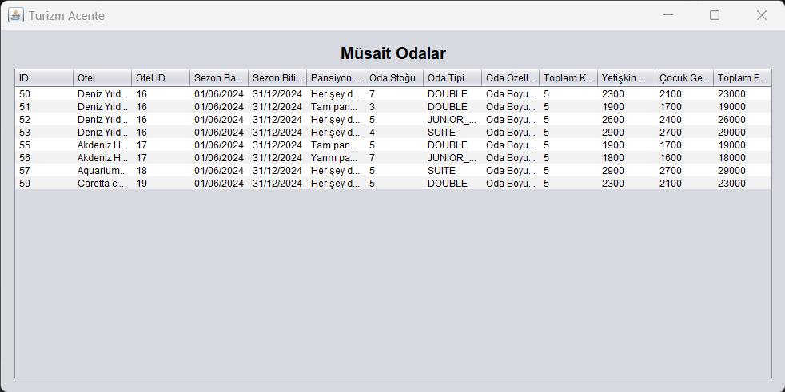
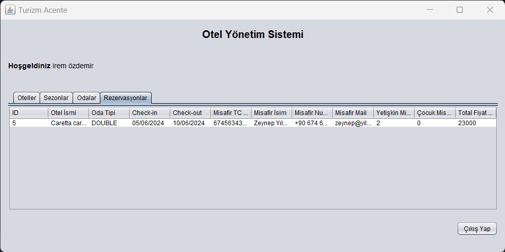 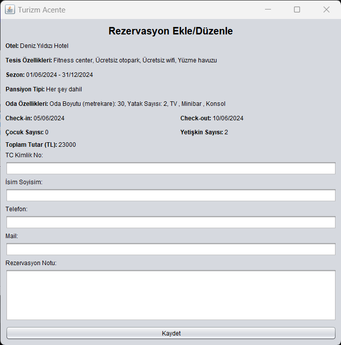


The link to the video where I briefly explain the project: https://www.youtube.com/watch?v=_3v1Rv55Rl8

------------------------------------------------------------------------------------------------------
## Proje Değerlendirme Kriterleri  
6. maddeyi karşılayan kod satırları core /Database içinde verilmiştir.
7. maddeyi karşılayan kod satırları view /AdminView  içinde verilmiştir.
   * loadUserTable() ve loadUserComponent() metotları
8. maddeyi karşılayan kod satırları view/EmployeeView içinde verilmiştir.
   * loadHotelTable() metodu -otelleri listele-, loadHotelComponent() metodu -Otel ile birlikte tesis özellikleri, sezon ve pansiyon tipi ekle;otel sil, otele oda, oda özellikleri ve fiyat ekle-
   * loadSeasonTable() metodu -sezonları listele-, loadSeasonComponent() metodu -Sezon sil-
   * loadRoomTable() metodu -odaları listele-, loadRoomComponent() metodu -Oda güncelle, sil-
   * loadReservationTable() metodu -rezervasyonları listele-, loadReservationComponent() metodu -rezervasyon sil, güncelle-
9. maddeyi karşılayan kod satırları view/LoginView içinde verilmiştir.  
10. maddeyi karşılayan kod satırları view/HotelView içinde verilmiştir.
11. maddeyi karşılayan kod satırları (141-166) view/HotelView içinde verilmiştir.
12. maddeyi karşılayan kod satırları (179-188) view/HotelView içinde verilmiştir.
13. maddeyi karşılayan kod satırları view/RoomView içinde verilmiştir.
14. maddeyi karşılayan kod satırları view/RoomView içinde verilmiştir.
15. maddeyi karşılayan kod satırları view/EmployeeView sınıfındadır, loadHotelComponent() metodunda istenilen kriterlere uygun filtreleme yapılmaktadır.
16. Arama sonuçları view/RoomView sınıfına ait loadSearchedRoomTable() metodu kullanılarak listelenir.
17. view/ReservationView sınıfında, 63-67  satırları arasında toplan ödeme tutarı hesaplanmaktadır.
18. view/ReservationView sınıfında, 110-158 satırları arasında rezervasyon bilgileri alınıp kayıt yapılmaktadır.
19. business/ReservationManager sınıfında, 32-37 satırları arasında stok azaltılmaktadır.
20. maddeyi karşılayan kod satırları view/EmployeeView içinde verilmiştir. loadReservationTable() metodu listeleme yapmaktadır.
21. maddeyi karşılayan kod satırları view/EmployeeView içinde verilmiştir. loadReservationComponent() metodu ilgili metotları çağırarak güncelleme yapar.
22. maddeyi karşılayan kod satırları view/EmployeeView içinde verilmiştir. loadReservationComponent() metodu ilgili metotları çağırarak silme işlemi yapar.
23. business/ReservationManager sınıfında, 56. satırdaki kodla stok artırılmaktadır.
24. core/Helper sınıfı, showMessage() metodu ile uygun pop up mesajları verilmektedir.
25. core/Helper sınıfı, showMessage() metodu ile hata mesajları verilmektedir.

